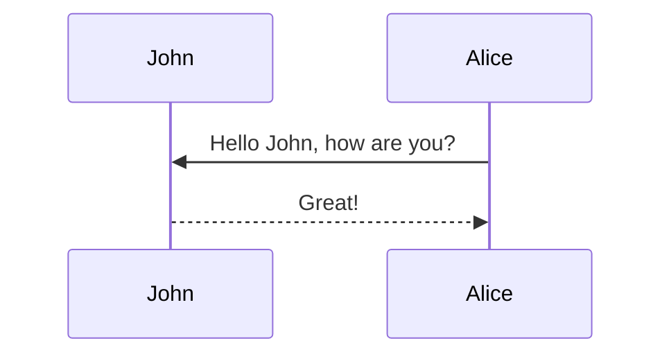

This theme supports generating various diagrams from a text description using [mermaid](https://mermaid-js.github.io/mermaid/){:target="\_blank"}. Previously, this was done using the [jekyll-diagrams](https://github.com/zhustec/jekyll-diagrams){:target="\_blank"} plugin. For more information on this matter, see the [related issue](https://github.com/alshedivat/al-folio/issues/1609#issuecomment-1656995674). To disable the zooming feature, set `mermaid.zoomable` to `false` in this post frontmatter.

## Mermaid

We now try SWP of Baldur's drum teaching app

```mermaid
flowchart TD
    %% Entities
    U[Drummer DID]:::entity
    DK[DrumKitEntity]:::entity
    TW[TimingProfileDigitalTwin]:::entity

    %% Agents
    SA[SeparatorAgent]:::agent
    OA[OnsetAgent]:::agent
    MA[MatchAgent]:::agent
    FA[FeedbackAgent]:::agent
    PA[PolicyAgent]:::agent
    TA[TeacherAgent]:::agent

    %% Graph
    SG[[SpatialGraphStore]]:::graph

    %% Local audio flow
    U -->|plays| DK
    DK -->|mono audio in| SA
    SA -->|kick/snare/hihat streams| OA
    OA -->|onset events| MA
    MA -->|timing metrics| FA

    %% Privacy and policy
    PA --- SA
    PA --- OA
    PA -->|enforces rules| SG

    %% Graph interactions
    FA -->|feedback summary, signed credentials| SG
    SG --> TW
    TW --> TA
    TA -->|personalised coaching plan| SG
    SG --> FA

    %% Styles
    classDef entity fill=#ffd580,stroke=#d19400,stroke-width=2px;
    classDef agent fill=#b3d1ff,stroke=#0059b3,stroke-width=2px;
    classDef graph fill=#d5f5e3,stroke=#1e8449,stroke-width=2px;
```

The diagram below was generated by the following code:

````markdown

````


