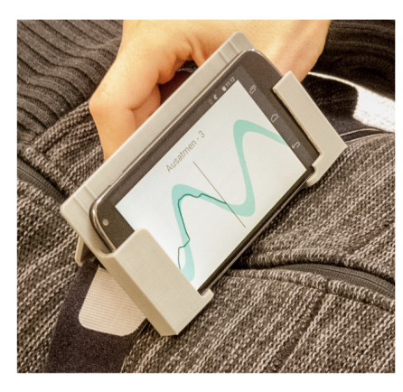

This is a container for semester project ideas for the MED students.

The MED1-6 students should consider classical Signal Processing or AR/VR projects, whereas MED7 and above who take / took the Machine Learning Course (MLME) could also consider Machine Learning projects.

The following MATLAB-based external resource is a good place to think about the scope, content, context, and value of semester projects.

* [MATLAB Excellence in Innovation Projects](https://github.com/mathworks/MathWorks-Excellence-in-Innovation)

# {#1} Mobile App for Exploration of Local Resources 

Many small business owners struggle for customer attention / discovery in the greater Copenhagen Area. By using recommendation-based algorithms on mobile platforms, can you design and evaluate a mobile app to provide small businesses value over the more common, chain institutions?

{:height="256px" }

*Mockup image After Krupa, Maria, 2022, "Impact of gamification on user's engagement and exploration of local cafes in Copenhagen Greater Area", Master's Thesis, Aalborg University Copenhagen*

## Variations / Ideas

- Gamification: narrative, timer, badges, points, or leader boards
- Evaluation:  user engagement, perceived usability.
- Camera-based recognition
- Machine Learning (for MED7 and above)
- Augmented Reality

## Example Hypothesis (P1)

Gamification can enhance user engagement on a mobile application, and encourage users to explore small businesses within the Greater CPH Area.

# 2. Design, Deployment, and Evaluation of an Audio-Visual Breathing App

Regularizing breath have many proven health and psychology benefits. It is also a backbone of many completative practices, such as meditation or martial arts. Can technology help in regularizing people's breath?

*Left: A vest-based breath regularization app, right: a microphone-based breath regularization app. After Guruvayurappan, Vatsal, "An audio-visual breathing application and its benefits on human psychology (mental health)", 2021, Master's Thesis, Aalborg University Copenhagen*

## Variations / Ideas

- Gamification: subtle narrative, timer, badges, points, or leader boards
- Evaluation:  Interviews, physilogical logs,
- Microphone, Gyroscope, IMU, or Camera-based recognition
- Machine Learning (for MED7 and above)
- Augmented, Virtual, or Extended Reality, including native or Web-based XR
- Gradio, Flask, or Streamlit Deployment

## Example Hypotheses (P1)

* The users find it easy to practice breathing exercises with the help of the designed application.
* If audio-visual feedback for the breath input is provided to the user, then they will be able to focus on their breathing in appropriate manner.
* Breathing exercises are effective in reducing anxiety
